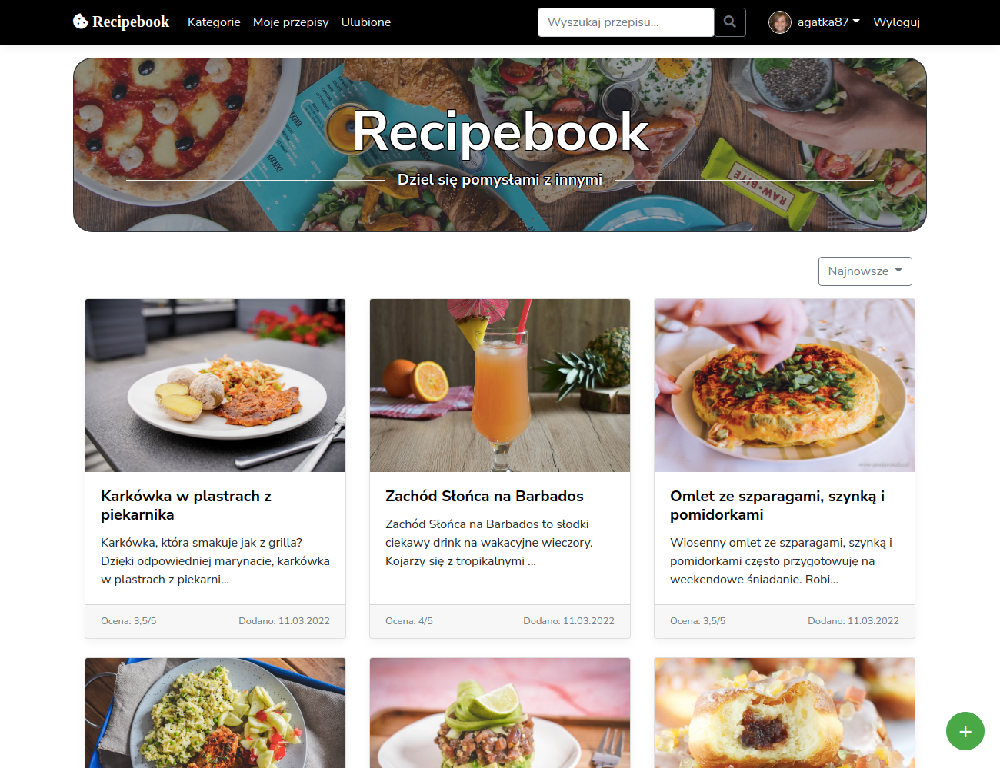
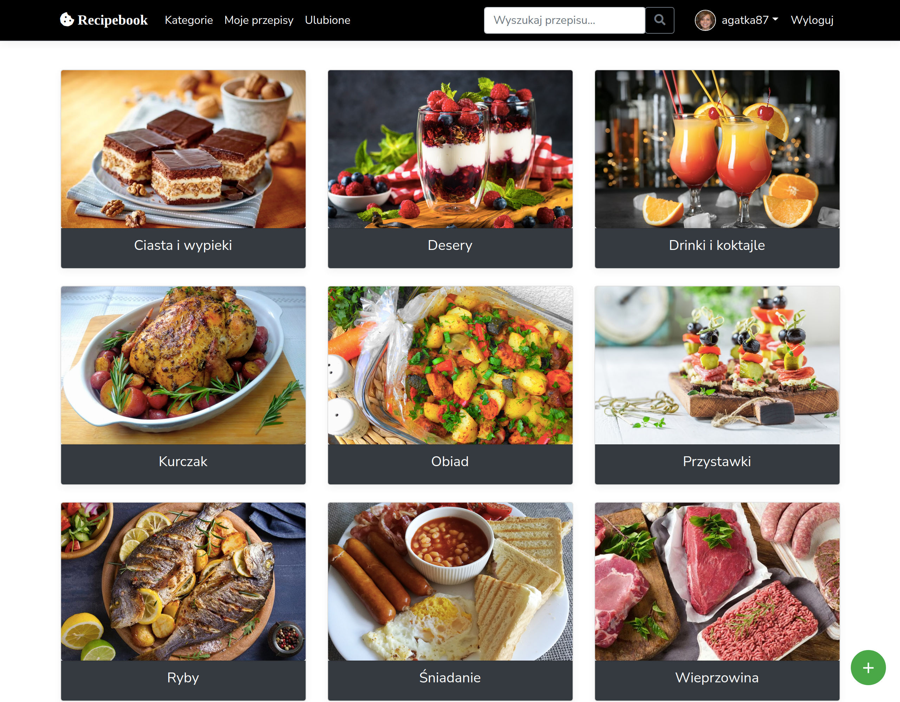
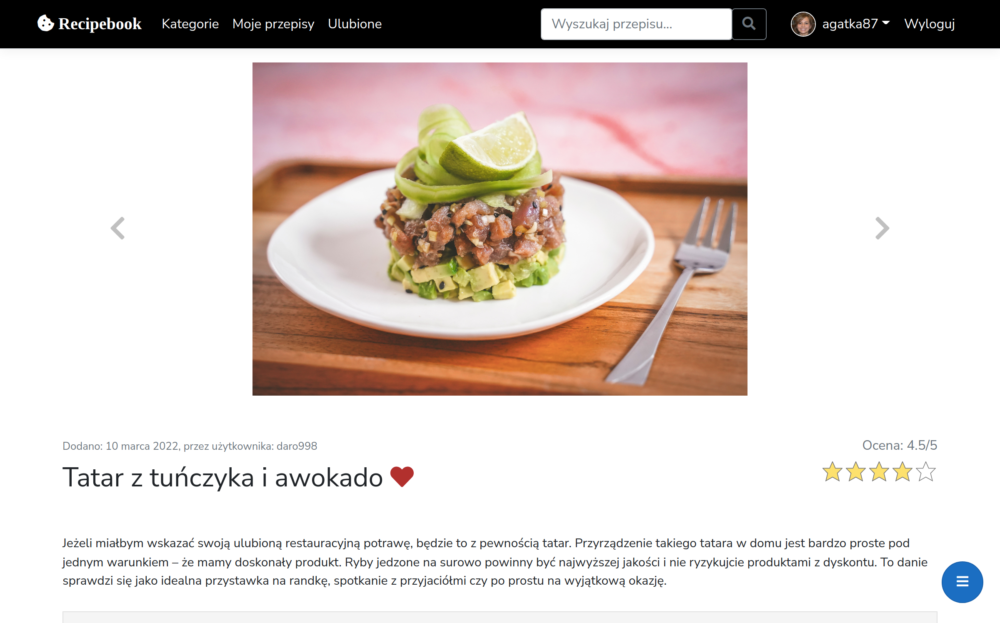

# Recipebook
A web application using the MVC pattern that brings together people who want to share their culinary recipes with others. App has features like:
- Adding recipes with photos
- Adding ingredients as 'tags'
- Option to rate and comment on the recipe
- Access facilities such as searching, sorting and pagination

## Some preview images
### Main page

### Categories

### Part of recipe

## Disclamer
As this is my first larger project and created quite a long time ago, there may be some errors in the code and work of the application.
